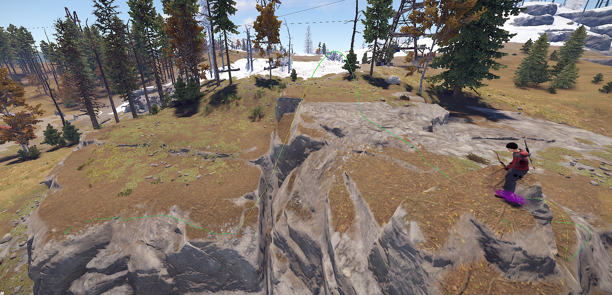
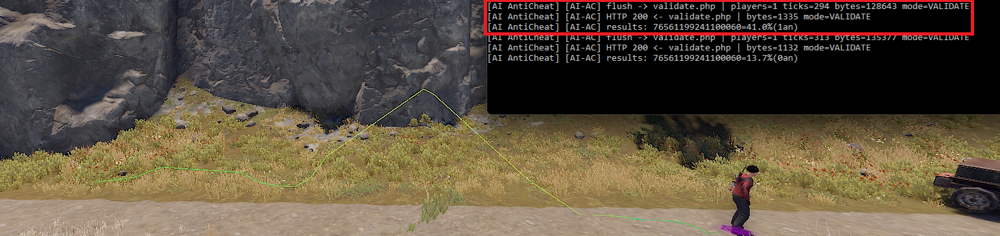

# AI AntiCheat for Rust

> **⚠️ Concept — not a release.** This is an early proof-of-concept, not production-ready software. APIs, schemas, model architecture and feature set will keep changing. Expect rough edges, missing pieces, and breaking changes between commits. Don't deploy this on a serious public server yet — run it on a private testbed, learn from it, and follow along while it matures.

Movement anomaly detection for Rust game servers. The plugin streams per-tick telemetry to a PHP backend, which scores it through a PyTorch autoencoder trained only on legit play. Anomalies are flagged in real time and drawn for online admins as a coloured 3D track.



The green line above is an actual gameplay track in Rust, drawn by the plugin via `ddraw.line` with per-tick colour from the model. Green = matches the player's normal movement, yellow/red would indicate growing anomaly.

## What it catches

- Fly hacks, including subtle ones (sustained +0.3 m/s upward = 100% risk in tests)
- Teleports (hard rule: ≥2 spikes ≥100 m/s position residual)
- Speedhacks beyond clothing-adjusted limits
- Any sustained movement that breaks the gravity equation `(vy - prev_vy)/dt + 9.81 ≈ 0`

## What it doesn't catch

- Aimbots, soft-aim, silent-aim — invisible in movement data
- No-recoil mods — recoil pattern lives outside positional ticks
- Wallhack / ESP — players just see more, they don't move differently
- Anything strictly inside the envelope of physically possible movement

This is a movement detector. Run it alongside the game's built-in anti-cheat, not instead of it.

## How it works

```
┌──────────────────────────┐  HTTPS + HMAC   ┌────────────────────────┐
│ Rust server (Oxide)      │ ───────────────►│ PHP backend            │
│ plugin/AIAntiCheat.cs    │                 │ server/validate.php    │
│  • OnPlayerTick → buffer │                 │  • per-tick autoencoder│
│  • flush every 15 s      │ ◄───────────────│  • smoothed peak risk  │
│  • DDraw coloured track  │  per-tick risks │  • hard physical rules │
│  • kick / log on >75%    │                 │  • per-player baseline │
└──────────────────────────┘                 │ SQLite + gzip          │
                                             └────────────────────────┘
                                                       ▲
                                                       │
                                             ┌────────────────────────┐
                                             │ Python trainer         │
                                             │ training/train.py      │
                                             │ → server/neural_model  │
                                             │   .json                │
                                             └────────────────────────┘
```

The model is a small autoencoder — 27 input features per tick, 64-12-64 hidden, ReLU. It's trained to reconstruct legit ticks; reconstruction error then becomes the anomaly score. A peak-of-smoothed-window over 8 ticks is calibrated against the 95th percentile of legit sessions, so the scoring is meaningful out of the box.

The 27 features include kinematics (speed, vy, height), derivatives (rotation acceleration, position residual), physics-aware terms (`gravity_residual` is the one cheats can't fake without breaking visibility), and 16-tick rolling aggregates that catch sustained patterns the per-tick MSE averages out.

## Live operation



Every flush you see the batch go out, the HTTP response come back, and the per-player risk for that window. `aiac.flush` triggers a manual flush instead of waiting 15 s.

## Setup

### Backend (any PHP host with PDO + SQLite)

```bash
git clone https://github.com/koroba4ka/AI-Rust-AntiCheat.git
cd AI-Rust-AntiCheat
cp server/config.php.example server/config.php
# edit server/config.php — set AC_SECRET and AC_ADMIN_SECRET to long random strings
```

Upload the contents of `server/` to your host. The SQLite database is created on the first request.

### Trainer (Python 3.10+)

```bash
cd training
install.bat              # pip install torch numpy
# put your collected anticheat.sqlite in the project root, then:
run_train.bat            # python train.py
```

`server/neural_model.json` is generated. Upload it next to the PHP files.

### Plugin (Rust + Oxide)

Drop `plugin/AIAntiCheat.cs` into `oxide/plugins/`. Edit `oxide/config/AIAntiCheat.json`:

- `Secret` — same value as `AC_SECRET` in the backend config
- `ValidateEndpoint` / `CollectEndpoint` / `CommandEndpoint` — your hosted URLs

Then `oxide.reload AIAntiCheat`.

## Workflow

1. **Collect.** Keep the plugin in `Collect Mode = true`. Play with verified-clean players for at least 30 hours across diverse situations: combat, cargo runs, vehicles, jumps off cliffs, swimming, base building. The more variety, the tighter the model.
2. **Train.** Pull `anticheat.sqlite` from the host, run `train.py`, run `verify.py` to sanity-check, push the new `neural_model.json` back.
3. **Validate.** `aiac.mode` toggles into validate mode. The plugin starts scoring live and acting on `AutoActionThreshold`.

The dashboard at `https://<host>/index.php` shows the session list, per-tick risk timeline, and the same coloured 3D track as in-game. Admins can label sessions cheater/legit/unsure, which feeds `evaluate.py`.

## Plugin commands

| Command | Effect |
|---|---|
| `aiac.status` | Mode, queue, counters |
| `aiac.mode` | Toggle COLLECT ↔ VALIDATE |
| `aiac.flush` | Force-send the buffer now |
| `aiac.debug on` / `off` | Verbose logs of each request |
| `aiac.whitelist <steamid>` | Toggle a player out of analysis |

## Detection numbers

Tested against synthetic injections on top of real legit sessions, after training on 12 hours of mode=0 data:

| Pattern | Risk |
|---|---|
| Subtle fly +0.3 m/s for 3 s | 100% |
| Subtle fly +1.0 m/s for 1.5 s | 100% |
| Speedhack at 25 m/s for 1 s | 76% |
| Teleport, 3× 15 m jumps | 95% (hard rule) |
| Aim-snap, 5 ticks at 380°/tick | +37% over baseline |

False-positive rate on unverified mode=0 sessions: ~7% above the 70% flag threshold. With verified-clean training data and 30+ hours coverage this drops below 3%.

## Repository layout

```
.
├── plugin/           Oxide C# plugin
├── server/           PHP backend + dashboard
│   └── config.php.example
├── training/         Python trainer + verify/evaluate scripts
├── docs/screenshots/
├── README.md
├── LICENSE
└── .gitignore
```

`training/features.py` and `server/features.php` must stay byte-for-byte equivalent. `verify.py` checks this automatically.

## Security notes

- HMAC-SHA256 on every request, with a timestamp window of ±60 s — captured traffic can't be replayed.
- Two separate secrets: `AC_SECRET` (plugin ↔ backend) and `AC_ADMIN_SECRET` (dashboard + push commands).
- `api.php?action=push_command` accepts only a whitelisted set of command types.
- All SQL via prepared statements, secret comparisons via `hash_equals`.

## Limits worth knowing

- PHP forward-pass is fine up to ~100 concurrent players. Beyond that, host the inference in Python.
- The HMAC scheme protects against replay but not against a leaked `AC_SECRET` itself. Rotate it if you suspect compromise.
- The model is bound to its training distribution. Brand-new biomes, transports, or game updates may need a retrain before the false-positive rate settles back down.

## License

MIT — see [LICENSE](LICENSE).
